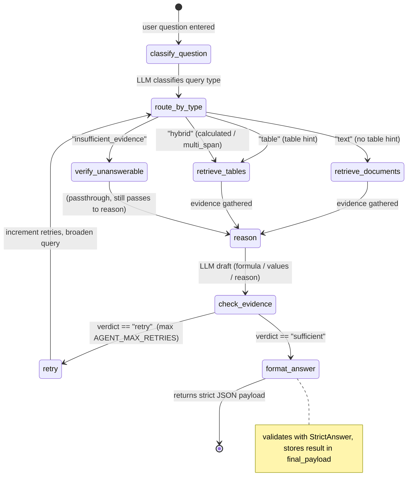

---# LEDGER Agent‑Service (LangGraph Reasoning Brain)

**Repository:** `agent-service/` (inside `Final_Project`)  
**Purpose:** Provides the core reasoning engine for the **LEDGER** financial‑document QA system. It receives a natural‑language question, classifies it, retrieves evidence from the (optional) retrieval‑api, runs a deterministic calculator when needed, and returns a strict JSON answer that conforms to the LEDGER **Strict Answer Schema** (four answer types: `direct`, `calculated`, `multi_span`, `insufficient_evidence`).  

The service is designed to run as one of seven microservices (orchestrator, doc‑processor, retrieval, eval, UI, answer‑validator) but can also be exercised standalone for development and testing.

---

## 1️⃣ Service Overview & Purpose

| Component | Responsibility |
|-----------|----------------|
| **LangGraph state graph** (`app/graph.py`) | Coordinates classification → retrieval → reasoning → evidence checking → answer formatting. The graph is **mixed‑sync/async**: LLM calls (`classify_question`, `reason`) are `async`; retrieval, checks, and formatting are pure Python. |
| **`LLMClient`** (`app/llm_client.py`) | Thin wrapper around an OpenAI‑compatible chat endpoint. Supports three providers (Gemini primary, Groq secondary, local mock for CI). Provider is selected via the `AGENT_LLM_PROVIDER` env var. |
| **`calculate()`** (`app/tools/calculator.py`) | Pure‑Python safe‑evaluator that only accepts `+ - * / // %` and `abs(...)`. Used exclusively for `calculated` answers, guaranteeing that no arithmetic is performed from LLM memory. |
| **`format_answer`** (`app/graph.py`) | Builds the final JSON payload that matches the **LEDGER Strict Answer Schema** and validates it with Pydantic `StrictAnswer`. The payload always contains `answer_type`, `evidence` (list of `document_id`, `page`, `section`), and `params` (type‑specific). |
| **FastAPI entry point** (`app/main.py`) | Exposes a single endpoint `POST /query` that accepts `{ "question": "…", "context": "…", "documents": [...] }` and returns the structured answer. |

The service is **stand‑alone testable** (mock LLM & retrieval) and **plug‑able** into the full LEDGER microsystem (Docker‑Compose, environment variables, etc.).

---

## 2️⃣ Environment Variables

| Variable | Required? | Default / Description |
|----------|-----------|-----------------------|
| `AGENT_LLM_PROVIDER` | **Yes** (default `gemini`) | Provider to use for LLM calls. Accepted values: `gemini`, `groq`, `mock`. |
| `GEMINI_API_KEY` | Yes (when `provider=gemini`) | API key for Google Gemini (via `google‑genai`). |
| `GROQ_API_KEY` | Yes (when `provider=groq`) | API key for Groq (llama‑3.3‑70b‑versatile). |
| `TOP_K` | No (default `5`) | Number of retrieval results to return from `search_documents` / `search_tables`. |
| `AGENT_MAX_RETRIES` | No (default `2`) | Maximum number of retry attempts when the evidence check deems the current evidence insufficient. |
| `GEMINI_MODEL` | No (default `gemini-3.6-flash`) | Model name for Gemini. |
| `GROQ_MODEL` | No (default `llama-3.3-70b-versatile`) | Model name for Groq. |
| `RETRIEVAL_MOCK` | No (default `False`) | When `True`, the retrieval wrappers return deterministic stub results instead of calling the external retrieval‑api. Useful for local development and CI. |

These variables are read from the `.env` file (or the process environment) by `app/config.py`'s `Settings` class (`pydantic_settings.BaseSettings`).

---

## 2️⃣ LangGraph Architecture & Node Flowchart

Below is a **Mermaid** flowchart that shows the control flow of the LangGraph.  The diagram is rendered in any Markdown viewer that supports Mermaid (e.g., GitHub, VS Code, Obsidian).



**Key points in the flow**

1. **`classify_question`** – LLM returns `query_type` (`direct|calculated|multi_span|insufficient_evidence`) and extracted `entities` (company, period, metric, `table_hint`).  
2. **`route_by_type`** – decides which retrieval branch to take.  
   * `text` → `retrieve_documents` (semantic search).  
   * `table` → `retrieve_tables` (table‑specific search).  
   * `hybrid` → `retrieve_tables` (calculated / multi‑span questions usually need both).  
   * `insufficient_evidence` → `verify_unanswerable` (passthrough, then to `format_answer`).  
3. **`reason`** – LLM receives the user question + evidence string and returns a **draft** containing either `value` (direct), `formula` (calculated), `values` (multi‑span) or `reason` (insufficient).  
4. **`check_evidence`** – deterministic node that:  
   * For `calculated` → runs `calculate(formula)`.  
   * For `multi_span` / `direct` / `insufficient_evidence` → validates evidence presence.  
   * Returns a `verdict` (`sufficient | retry | give_up`).  
5. **`retry`** – increments `retries`, broadens the search query, and re‑routes back through `route_by_type`. After `AGENT_MAX_RETRIES` the graph proceeds to `format_answer`.  
6. **`format_answer`** – builds the final JSON, injects evidence citations (`document_id`, `page`, `section`), validates against `StrictAnswer`, and stores the result in `state["final_payload"]`.

---

## 3️⃣ API Endpoint Specification

### `POST /query`

**Request (JSON)**

```json
{
  "question": "What was the total revenue in Q3?",
  "context": "In Q3, total revenue reached $5.2 million.",   // optional
  "documents": [                                        // optional, raw PDF excerpts
    { "document_id": "doc_041", "page": 2, "section": "Income Statement", "content": "…" }
  ]
}
```

**Successful Response (JSON)**  

The `answer` field always contains a payload that conforms to the LEDGER strict schema.  Below are four example payloads, one for each answer type.

| Answer type | `answer` JSON (truncated) |
|-------------|---------------------------|
| **direct** | ```json { "answer_type": "direct", "evidence": [ {"document_id":"doc_041","page":2,"section":"Income Statement"} ], "params": { "value": "$5.2 million" } }``` |
| **calculated** | ```json { "answer_type": "calculated", "evidence": [ {"document_id":"doc_041","page":2,"section":"Balance Sheet"} ], "params": { "value": 12345.6, "formula": "(revenue‑expenses)" } }``` |
| **multi_span** | ```json { "answer_type": "multi_span", "evidence": [ {"document_id":"doc_041","page":3,"section":"Operating Expenses"} ], "params": { "values": ["Marketing","R&D","Logistics"] } }``` |
| **insufficient_evidence** | ```json { "answer_type": "insufficient_evidence", "evidence": [], "params": { "reason": "No document in the indexed corpus reports restructuring expenses." } }``` |

**`curl` examples**

```bash
# direct question
curl -X POST http://127.0.0.1:8004/query \
  -H "Content-Type: application/json" \
  -d '{"question":"What was the operating income reported in 2020?"}'

# calculated question (needs a formula)
curl -X POST http://127.0.0.1:8004/query \
  -H "Content-Type: application/json" \
  -d '{"question":"What is the percentage change between 2020 and 2021 revenue?"}'

# multi_span question (list of items)
curl -X POST http://127.0.0.1:8004/query \
  -H "Content-Type: application/json" \
  -d '{"question":"List the three largest expense categories in 2021."}'

# unanswerable question
curl -X POST http://127.0.0.1:8004/query \
  -H "Content-Type: application/json" \
  -d '{"question":"What were the restructuring expenses in 2019?"}'
```

All responses have HTTP status **200** and a JSON body whose `answer` field matches one of the four schemas above.

---

## 4️⃣ Local Development & Testing

### 1️⃣ Install dependencies

```bash
cd agent-service

# Install exactly one option:
pip install -r requirements-gemini.txt  # Gemini
pip install -r requirements-groq.txt    # Groq (not xAI Grok)
pip install -r requirements-light.txt   # mock mode; no cloud SDK
```

### 2️⃣ Set required environment variables

```bash
export AGENT_LLM_PROVIDER=gemini          # or groq / mock
export GEMINI_API_KEY=YOUR_GEMINI_KEY     # required for gemini provider
# export GROQ_API_KEY=YOUR_GROQ_KEY      # optional, for groq provider
export TOP_K=5                            # optional
export AGENT_MAX_RETRIES=2                # optional
```

> **CI / quick test** – you can run the service with the built‑in mock provider:

```bash
export AGENT_LLM_PROVIDER=mock
```

### 3️⃣ Launch the server

```bash
uvicorn app.main:app --host 0.0.0.0 --port 8004 --reload
```

The server will be reachable at `http://127.0.0.1:8004`.

### 4️⃣ Test the endpoint

```bash
curl -X POST http://127.0.0.1:8004/query \
  -H "Content-Type: application/json" \
  -d '{"question":"What was the total revenue in Q3?"}'
```

You should receive a JSON payload like the **direct** example shown in the table above.

### 5️⃣ Run the test suite (if present)

```bash
# optional – runs any pytest files under tests/
pytest -q
```

---

## 5️⃣ File Summary (what you’ll find in the repo)

| File | Purpose |
|------|---------|
| `app/__init__.py` | Package version (`0.1.0`). |
| `app/config.py` | `Settings` class (env vars, `TOP_K`, `AGENT_MAX_RETRIES`, provider). |
| `app/state.py` | `AgentState` TypedDict – the single mutable state object for the graph. |
| `app/tools/calculator.py` | Safe recursive‑descent evaluator (only `+ - * / // %` + `abs`). |
| `app/tools/registry.py` | `TOOL_REGISTRY` dict mapping `"search_documents"`, `"search_tables"`, `"calculate"`, `"filter_documents"` → func + input schema. |
| `app/tools/retrieval.py` | HTTP wrappers (`search_documents`, `search_tables`, `filter_documents`) + deterministic stub. |
| `app/llm/client.py` | `LLMClient` – provider‑aware wrapper (Gemini/Groq/Mock) with flat schema support. |
| `app/graph.py` | LangGraph `StateGraph` with conditional edges, retry logic, evidence handling, and `format_answer`. |
| `app/main.py` | FastAPI app, `/query` endpoint, glue code that invokes the graph. |
| `requirements.txt` | Pinned dependencies (cloud‑only LLM packages). |
| `.env.example` | Example env‑var file (shows `AGENT_LLM_PROVIDER=gemini`, etc.). |

--- 

