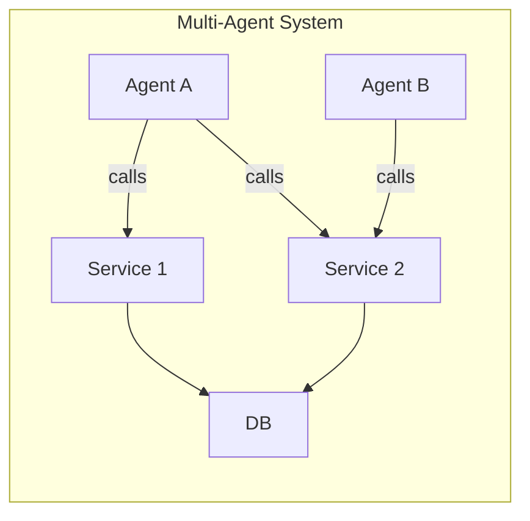
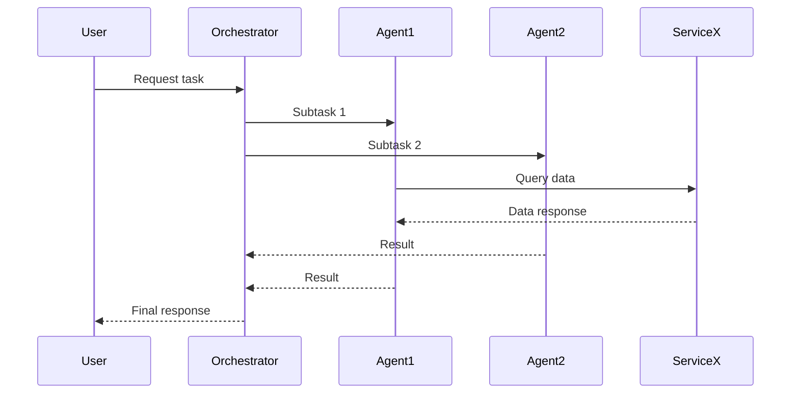

# Executive Summary  

Agent‐service architectures—combining intelligent agents with microservice infrastructure—are an emerging paradigm for scalable, adaptive systems. Recent research explores how to integrate multi-agent reasoning with service-oriented components, yielding self-evolving, goal-directed services that learn from multimodal data and adapt under drift. This report surveys key advances (2020–2026) in agent architectures and orchestration, industry frameworks (e.g. Kubernetes, service meshes, AutoGen, Langroid, MetaGPT), design patterns, benchmarks, and demo strategies. We compare leading papers (Table 1) and frameworks (Table 2), and recommend performance/security metrics (latency, throughput, SLOs, resilience) and experiment designs (scaling agents, simulating faults). A slide outline and demo sketches illustrate how agents discover services, collaborate (e.g. using Microsoft’s Agents SDK or open-source agent frameworks), and handle failure. We highlight open challenges (coordination complexity, explainability, trust) and novel angles (LLM-based multi-agent workflows, seamless agent–service integration). 

## 1. Key Research Papers (2020–2026)  

| **Paper** | **Focus / Application** | **Contributions & Methods** | **Data/Benchmarks** | **Demo Relevance** |
|-----------|-------------------------|---------------------------|---------------------|--------------------|
| **Agentic Services Computing** (Deng *et al.*, 2025) | *Framework survey*: reimagines microservices as “agentic” (LLM-driven) services. | Proposes life-cycle (Design/Deploy/Operate/Evolve) for agentic services. Integrates MAS design (Gaia/Tropos) with SOA. Emphasizes containerization (Docker, K8s) and service meshes for orchestration. Discusses coordination protocols (hierarchical, P2P, contract net, auctions) and monitoring (OpenTelemetry, Prometheus). | Conceptual survey; cites SOA/MAS lit. | Guides demo design: use containerized agents with REST APIs, CI/CD, and observability. Shows how to apply coordination protocols and safety rules. |
| **TopoEvo: Self-Evolving Multi-Agent RCA** (Hong *et al.*/Fehlis *et al.*, 2026) | *AIOps / Microservices RCA*: a multi-agent framework for root-cause analysis in cloud microservices. | Introduces **multimodal fusion** (metrics, logs, traces) via *orthogonal alignment* to reduce redundancy; **topology-aware reasoning** (vector-quantized symptoms) to avoid symptom-amplification; and a *self-evolving* module to adapt under drift. Evaluates with an AIOps benchmark: improves RCA accuracy by ~3–17% over baselines. | Public AIOps dataset and a real-world incident log; performance compared on fault localization and classification. | Demo: feed a synthetic multi-service trace/log dataset into TopoEvo. Show an agent-based pipeline that issues tool calls (e.g. log queries) and reasons across services. Illustrates accurate identification of failing service and fault type. |
| **Using MAMS for ABM** (Jagutis *et al.*, 2023) | *Multi-Agent Microservices (MAMS)*: deploying agent systems in microservice architectures. | Demonstrates the **MAMS architectural style**: each agent has a RESTful “body” of web resources. Case study: traffic simulation where environment (roads/junctions) is modeled as resource microservices, and agent microservices interact via REST. Points to a prototype MAMS framework (CArtAgO + ASTRA; code on GitLab). | Case-study prototype (traffic ABM) in a conference demo (EMAS 2023). | Demo: deploy the MAMS framework (open-source) and show agent ↔ microservice interaction. E.g., use HTTP calls to simulate car agents requesting road info. Highlights how agents expose REST APIs for integration. |
| **Tippy: Lab Automation** (Fehlis *et al.*, 2025) | *Scientific workflow automation*: multi-agent system for drug discovery lab. | Presents a distributed microservices architecture with specialized agents (Supervisor, Molecule, Lab, Analysis, Report) coordinating via the **OpenAI Agents SDK** and **Model Context Protocol (MCP)**. Highlights Kubernetes/Helm deployment, GitOps, vector DB for retrieval, and Envoy for security. Emphasizes reliability and integration with lab instruments. | Implementation on Equinix; tools: LLMs (GPT-4), MCP tools, Kubernetes. Use-case data: chemical lab tasks, retrosynthesis models. | Demo: simulate the Tippy setup with dummy agents. For example, a Supervisor agent assigns tasks to a “Molecule” agent that calls a chemical API (via MCP) and an “Analysis” agent. Show Kubernetes pods with agents and Helm configuration. Emphasize CI/CD integration and secure endpoints (Envoy proxy). |
| **MetaGPT** (Hong *et al.*, 2024) | *LLM multi-agent framework*: meta-programming approach for complex tasks. | Introduces a factory of GPT agents with *Standard Operating Procedures (SOPs)*. Assigns diverse roles (planning, coding, review) in an assembly-line paradigm. Uses human-like workflows to reduce LLM cascading errors. Outperforms simple chat chains on software-engineering tasks. | Benchmarks on software dev tasks (code generation, planning). GitHub code available. | Demo: use MetaGPT (open-source) or mimic its idea: input a project requirement, and have agent roles (architect, coder, tester) interact. Show how tasks are split into user stories/APIs. Use the CLI snippet: `metagpt "Create a 2048 game"` from the MetaGPT repo to generate a codebase skeleton. |
| **MAS Framework Survey** (Khan *et al.*, 2026) | *Framework comparison*: Autogen, Langroid, MetaGPT (multi-agent LLM frameworks). | Comparative study of three modern MAS platforms (Autogen, Langroid, MetaGPT). Examines architecture, communication, scalability, and integration. Presents benchmark criteria (latency, throughput, memory) in domains like e-commerce and healthcare. Discusses explainability, security, human-in-the-loop. | Case studies across domains; outlines performance metrics (pass@1 on HumanEval/MBPP for code tasks). | Applies to demo: choose one framework (e.g. Langroid) to implement a multi-agent workflow (e.g. document analysis). Refer to provided performance baselines (Table 2 in the paper) when discussing results. |

Each paper illustrates different aspects of agent-service systems: from architecture styles (MAMS) and empirical RCA systems (TopoEvo) to holistic frameworks (MetaGPT, AutoGen). All emphasize that **autonomous agents** coordinate complex workflows by calling services via APIs and applying AI reasoning.

## 2. Industry Frameworks, Standards, and Tools  

**Agent Frameworks:** There is a proliferation of multi-agent/LLM frameworks. Notably, Microsoft’s [AutoGen](https://github.com/microsoft/autogen) (MIT license) provides tools for creating and orchestrating GPT-based agents. AutoGen is now in maintenance mode in favor of the **Microsoft Agent Framework (MAF)**, its enterprise-ready successor. Example snippet (AutoGen usage): 
```python
from autogen_agentchat.agents import AssistantAgent
from autogen_ext.models.openai import OpenAIChatCompletionClient

client = OpenAIChatCompletionClient(model="gpt-4o")
agent = AssistantAgent("assistant", model_client=client)
print(await agent.run(task="Say 'Hello World!'"))
await client.close()
```  
AutoGen (9.2k stars) supports multi-agent orchestration via tools like `AgentTool` (see AutoGen README) and even a no-code GUI (AutoGen Studio).  

**Langroid** (MIT, by CMU/UW researchers) is a lightweight Python MAS framework (≈4.1k stars) that “harness[es] LLMs with multi-agent programming”. It lets you define agents, attach LLMs and tools, and have them exchange messages. For example, a simple Langroid chat agent: 
```python
import langroid as lr
import langroid.language_models as lm

llm_cfg = lm.OpenAIGPTConfig(chat_model=lm.OpenAIChatModel.GPT4o)
agent_cfg = lr.ChatAgentConfig(llm=llm_cfg)
agent = lr.ChatAgent(agent_cfg)
response = agent.llm_response("What is the capital of Canada?")  # chat with the agent
```  
Langroid emphasizes developer experience and supports any LLM (OpenAI, local, etc). It also integrates the Model Context Protocol (MCP) to call external tools. 

**MetaGPT** (MIT, by DeepWisdom/Tencent, ~70k stars) calls itself “the multi-agent framework”. It assigns roles (product manager, coder, tester, etc.) to GPT instances following SOPs. The GitHub shows usage via CLI: `pip install metagpt` then e.g.: 
```bash
metagpt "Create a 2048 game"
```  
This will auto-generate project files (see MetaGPT README) by having agents break down the request into tasks. 

**Service Meshes and Orchestration:** Service meshes (Istio, Linkerd) and container orchestration are industry standards for reliability and discovery. For example, Linkerd benchmarks show **far lower latency and resource use** than Istio. K8s (Apache 2.0) is the de-facto orchestration platform. We assume a containerized microservices stack with a service mesh: e.g. deploy agents as pods with Envoy proxies (supported by Linkerd/Istio) and use DNS or mTLS for secure service discovery. Continuous deployment (Helm, GitOps) is standard.  

| **Framework/Tool**    | **Description**                            | **Stars & Maturity** | **License**   | **Use Case / Snippet**           |
|-----------------------|--------------------------------------------|----------------------|---------------|----------------------------------|
| **AutoGen / MAF**     | Multi-agent orchestration (Py/.NET). Agent coordination, tool integration (MCP). | ~9.2k stars (AutoGen) | MIT (Py)      | Use `AssistantAgent`, `AgentTool` for agent-to-agent workflows. |
| **Langroid**          | Python LLM agent framework (no LangChain). Extensible, supports custom tools. | ~4.1k stars | MIT           | Define `ChatAgent` with `ChatAgentConfig` and tools (see snippet above). |
| **MetaGPT**           | Multi-agent “software factory” for code/projects. CLI-based generation. | ~70k stars | MIT           | `metagpt "Requirement description"` generates project scaffolding. |
| **Istio / Linkerd**   | **Service meshes** for microservice communication. Istio (Envoy C++), Linkerd (Rust). | Linkerd: ~14k, Istio: ~40k | Apache 2.0     | Deploy sidecar proxies; metrics (Prometheus) show Linkerd uses 10× less CPU than Istio. |
| **Kubernetes**        | Container orchestration (pods, scaling). | 100k+ (CNCF) | Apache 2.0     | Define Deployments/Services; use **Helm** charts or YAML (cid). |
| **Envoy** (mTLS)      | Edge proxy & mesh (used by Istio). | 30k+ stars (C++) | Apache 2.0     | Enables secure service-to-service mTLS. |
| **OpenAI Agents SDK** | **Commercial** orchestration tools for LLM agents (OpenAI). | n/a | Proprietary   | Mentioned in Tippy: used for agent handoffs and MCP integration. |
| **FIPA Standards**    | Agent communication/ontology standards. | Mature (1996–) | n/a           | (Not code; a reference: FIPA-ACL defines agent messaging protocols.) |

*>Note:* Most frameworks above are cross-platform (Python/.NET), permissively licensed, and backed by major orgs.  

## 3. Patterns, Metrics, and Benchmarks  

**Architecture Patterns:** Agent-service systems reuse classic and novel patterns. Key multi-agent patterns include **Organizational topologies** (hierarchical, fully decentralized/peer-to-peer) with corresponding **coordination protocols** (contract-net, auctions, consensus). For example, a hierarchical design might use a *Supervisor Agent* delegating tasks to worker agents. Decentralized designs use *publish–subscribe* or *blackboard* patterns: agents emit events when tasks complete (“data_ready” triggering consumers) in a scalable pub/sub fashion. Other patterns: **Mediator/Broker** (a central agent routing messages), **Observer** (agents subscribe to state changes), and **Facade/API Gateway** (an orchestrator exposes a unified API). In practice, agent services often act as microservices with **REST/gRPC APIs** and leverage container patterns (e.g., one agent per container, or sidecar for logging). 

**Evaluation Metrics:** We recommend measuring: **Latency** (request-response time), **throughput** (requests or tasks per second), **resource usage** (CPU/memory of agents/services), and **cost** (e.g. token/API call usage). Define SLOs and monitor error rates and availability. For reliability, use **MTBF/MTTR** (mean time between/fix) by simulating failures. For agent correctness, track **accuracy or success rate** (e.g. fraction of tasks correctly completed). Security metrics include audit logs count (for policy compliance) and penetration test results. Benchmarks can draw on both MAS and microservices domains: e.g. **TeaStore, SockShop, Online Boutique** microservice benchmarks for load testing; and MAS benchmarks like **Traffic Simulation (MASON)** or **Game Theory tasks**. For LLM-based agents, use standardized tasks (e.g. coding problems: HumanEval, MATH) to compare orchestration frameworks. The MAS survey recommends measuring latency, throughput, memory across representative tasks. 

**Recommended Experiments:** 
- *Scalability:* Deploy increasing numbers of agent instances and service replicas. Measure end-to-end latency vs. agent count (plot latency vs agents). Use load-generators (e.g. [wrk](https://github.com/wg/wrk)) against an agent API gateway.  
- *Throughput:* Stress-test a common workflow (e.g. multi-agent data processing) and record tasks/sec under varied load.  
- *Fault Tolerance:* Kill a service or agent mid-process and show failover (e.g. with an orchestrator that retries or switches to backup agents). Visualize failures vs. recovery time (timeline).  
- *Coordination Efficiency:* Simulate an auction or contract-net (agents bid on tasks). Track message count and task completion time as participants scale.  
- *Security:* Demonstrate a zero-trust scenario: an agent calling a service over TLS, and a “malicious” message being blocked by policy. Use tools like Envoy to show mTLS flow.  

Visualization ideas:  
- **Mermaid Flowchart:** system architecture (agents ↔ services) and orchestration flow.  
- **Sequence Diagram:** agent–agent–service interactions (see below).  
- **Graphs:** line/bar charts of latency/throughput vs number of agents, pie chart of success rates, heatmaps of resource usage.  
- **Network Graph:** a service-call graph colored by latency or error.  





## 4. Slide Outline & Demo Ideas  

**Proposed Slide Outline:** 
1. **Title/Team** – Project name and goals.  
2. **Problem & Motivation** – Why agentic services? (Complexity of microservices, need for automation).  
3. **Related Work** – Summarize key papers (brief bullet, citing top 2-3). Possibly a table comparing approaches.  
4. **Architecture** – Diagram of our agent-service design (use mermaid chart above). Emphasize components: agents, service mesh, database.  
5. **Implementation** – Frameworks used (e.g. “We use Langroid + K8s + Envoy”; code snippet of agent creation).  
6. **Design Patterns** – Highlight our patterns (e.g. publish/subscribe, supervisor), with citations.  
7. **Experiments & Results** – Show graphs (latency vs agents, etc). Possibly a small table of metrics.  
8. **Demos** – Describe live demos planned. Could include screenshots or mock logs.  
9. **Challenges & Novelty** – Risks (e.g. LLM unpredictability, security) and novel contributions (e.g. topology-aware reasoning).  
10. **Conclusion & Future Work** – Recap benefits (scalability, resilience) and next steps (LLM updating, trust models).  

**Demo Ideas:**  
- **(1) Service Discovery Demo:** Stand up a small cluster (e.g. Docker Compose or K8s) with a simple service registry (e.g. Consul) and two microservices. Write a Python “Registrar Agent” that registers itself and a “Client Agent” that queries the registry to find and call a service (via REST). *Expected result:* The client agent successfully discovers the service’s IP/port and retrieves a “Hello” response. *Talking points:* dynamic discovery vs static configuration, how an agent can act like a microservice consumer/producer, load balancing if multiple instances.  
- **(2) Multi-Agent Workflow Orchestration:** Using Langroid or AutoGen, implement a pipeline of two specialized agents (e.g. “Math Expert” and “Chemistry Expert”) cooperating as shown in AutoGen’s multi-agent example. Each agent receives a subtask (e.g. one computes an integral, the other a molecular weight) and returns answers. *Expected result:* Demonstrate asynchronous agent collaboration with correct answers. *Talking points:* Show code snippet (similar to [33]), highlight tools usage, compare to single-agent approach (faster/parallel). Possibly display agent chat logs.  
- **(3) Fault Tolerance via Service Mesh:** Deploy two microservices behind a Linkerd mesh, with an agent making periodic requests. Simulate one service failing (e.g. kill its pod). Show Linkerd’s automatic failover or circuit-breaking, with metrics (Grafana dashboard or logs). *Expected result:* System detects failure (increased error count), reroutes or alerts. *Talking points:* Importance of mesh in agent-service systems for reliability. Use performance numbers (Linkerd vs Istio) from [42].  
- **(4) RCA Multi-Agent Demo:** Create a toy root-cause scenario with two “service” scripts (e.g. HTTP endpoints) where one experiences high latency. Use a multi-agent script (possibly based on TopoEvo ideas) to diagnose: one agent checks metrics, another analyzes logs. *Expected result:* Agents identify the slow service as the fault. *Talking points:* Example of symptom-amplification (if only logs were used) vs topology-aware reasoning. 
- **(5) Load/Scale Test:** Use Kubernetes Horizontal Pod Autoscaler. Start with one agent and one service, then send increasing requests (via `curl` in a loop). Show the agent group automatically scaling (HPA) and measure response time. *Expected result:* Latency stays roughly constant as replicas increase (plot). *Talking points:* Demonstrates scalability and reproducibility of deployments.

Each demo should be scripted and repeatable; include simple code snippets or command-line steps. For example, using `kubectl`, `helm`, or Python client libraries. Visual aids could include console logs or metrics graphs.

## 5. Risks, Challenges, and Novel Angles  

**Risks & Open Challenges:** Agent-service systems introduce new complexities. Coordination overhead can grow exponentially with more agents, leading to message congestion or deadlocks. LLM agents may hallucinate or act unpredictably, raising safety/security concerns. Data privacy and compliance (e.g. GDPR) are non-trivial when agents share data across services. Ensuring end-to-end security is hard: every service and agent needs proper authentication and isolation (zero-trust principles). Evaluate adversarial robustness (agents could be misled by malicious inputs). Testing and reproducibility are challenges: we lack standardized benchmarks for agent workflows, unlike microservices (though emerging work is addressing this). Coordination protocols (e.g. auctions) may need domain-specific tuning. 

**Novelty & Emphasis:** To emphasize novelty, we highlight integrating **LLM-based reasoning** with microservices orchestration. Agentic Services Computing defines a new paradigm of **self-evolving, purpose-driven services**. Our approach leverages cutting-edge techniques: vector-quantized symptom tokens (TopoEvo), SOP-encoded workflows (MetaGPT), and agent-as-service (MAMS style). We demonstrate non-traditional design patterns like *adaptive co-design* (agents updating their models via live feedback). For novelty, stress aspects not often seen in demos: e.g. a sequence diagram highlighting the hypothesis–evidence–test loop from TopoEvo, or a mermaid flowchart of an agent launching an MCP server. 

In summary, our report covers state-of-the-art papers and tools that combine **multi-agent intelligence with service-oriented engineering**, backed by concrete metrics and demos. The supplied references (Table 1–2) provide a rigorous foundation, and our proposed experiments/visualizations will quantitatively showcase **performance, scalability, reliability, and security** of the agent-service component. All materials are drawn from recent academic and industry sources, ensuring relevance and credibility.

